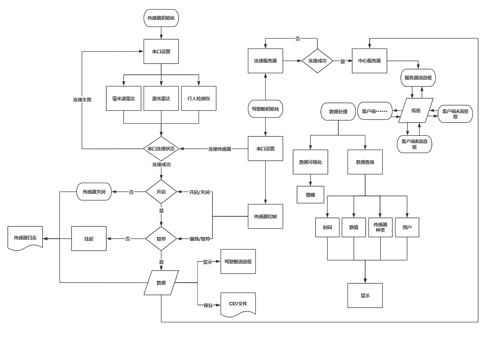
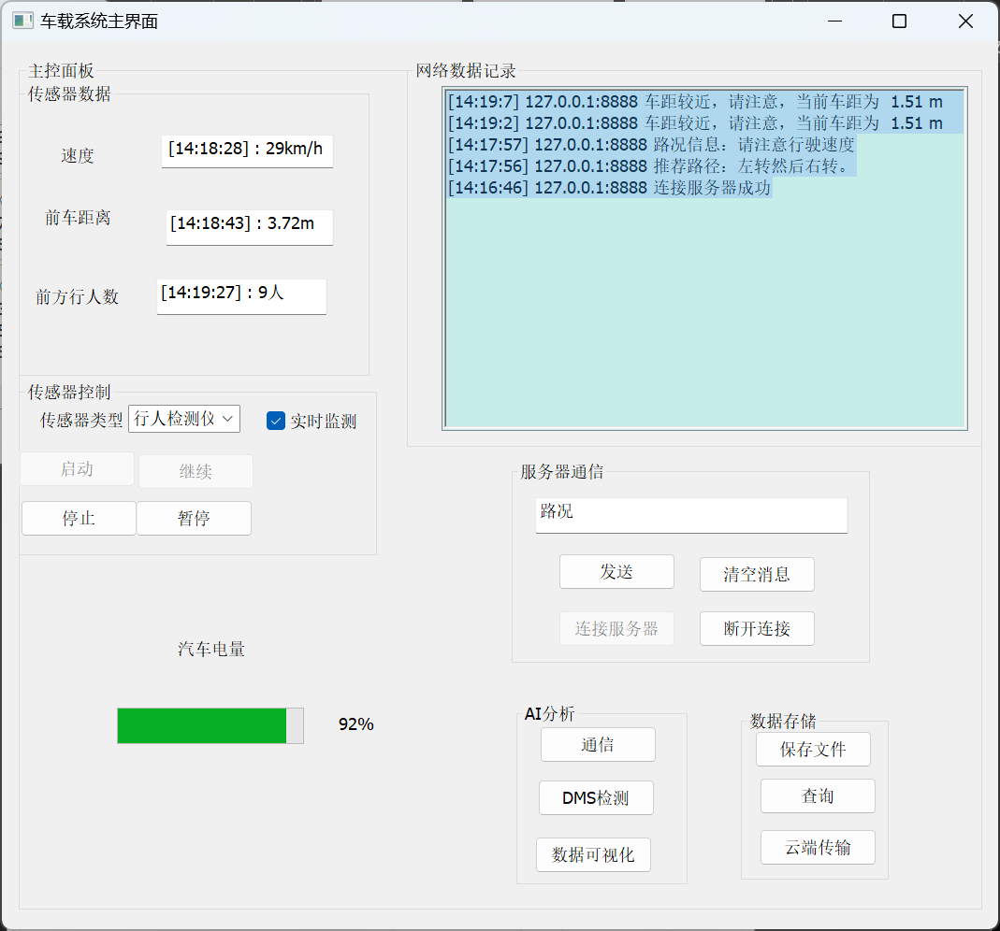
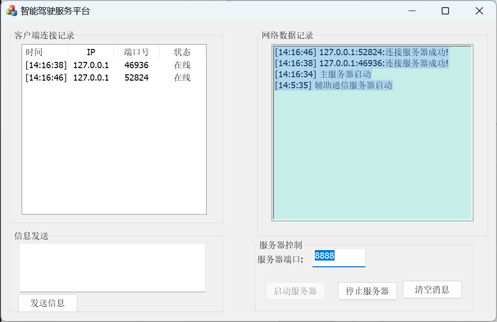
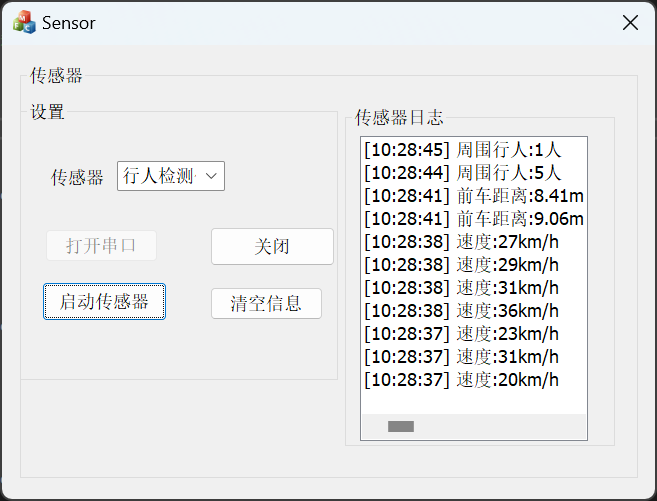
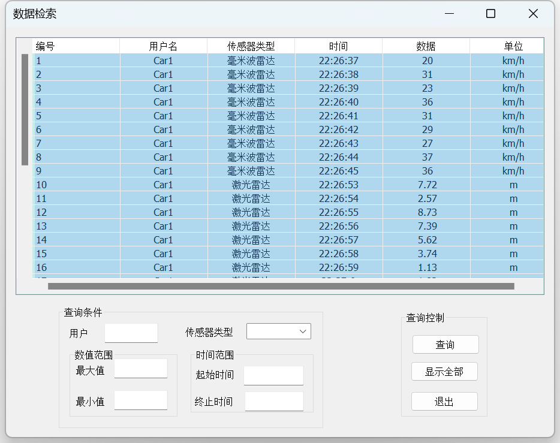
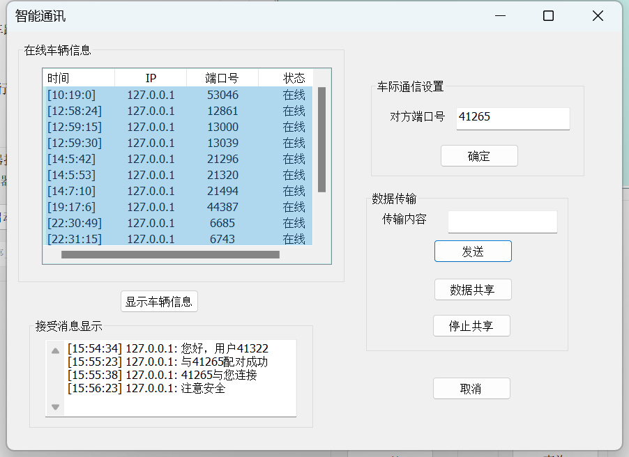

# Autonomous Driving Perception Communication System

我把这门课程设计做成了一个三端协同系统，而不是一个只演示单点功能的窗口程序。

在这个项目里，我要解决的不是“怎么写一个界面”，而是怎么把 `传感器采集`、`串口通信`、`TCP/IP 上传`、`服务端反馈`、`CSV 查询` 和 `车辆间消息交互` 串成一个能运行、能演示、也能继续扩展的完整链路。

## What This Repo Shows

- 我能先把问题拆清楚，再做实现，而不是直接堆功能
- 我能把 `设备侧 + 网络侧 + GUI + 数据留痕` 组合成一个完整系统
- 我不仅能把系统做出来，也能明确指出当前方案的工程边界和下一步演进方向

## Project Snapshot

`Course Project · 2024.02.01 - 2024.03.01`

`Role · 系统拆分、串口与 TCP/IP 通信实现、车辆交互流程设计`

我基于 `C++` 开发，综合使用了 `MFC`、`MSComm`、`WinSock`、`STL` 和多线程机制，完成了以下能力：

- 用传感器端模拟速度、车距、行人检测等感知数据
- 用车辆端接收串口数据、展示状态，并通过 TCP 上传服务端
- 用服务端维护连接、记录状态、回传信息并中转消息
- 用 CSV 完成基础日志留存和条件查询
- 在主数据链路之外，再做一条车辆间通信链路

## How I Framed The Problem

我先把题目拆成了四个子问题：

1. 传感器数据怎么稳定进入车辆端，而不是停留在单机模拟
2. 车辆端怎么同时承担采集、展示、上传和交互职责
3. 服务端怎么同时做接入、反馈、展示和简单存档
4. 车辆之间怎么在没有固定地址簿的前提下完成通信

对应地，我把系统拆成了三个端：

- `Sensor`
  负责模拟或采集传感器数据，并通过串口输出
- `Car`
  负责接收数据、展示状态、上传服务端、查询日志、发起车车通信
- `DataSrv`
  负责 TCP 监听、连接管理、信息回传、端口登记和消息中转

这套拆法是整个项目最核心的部分。因为一旦边界清楚，后面的实现就不再是“把代码写出来”，而是“把每一端的职责做完整”。

## System Flow

下面这张图直接来自我原始课程说明书，是我当时整理出来的整体流程图：

这张图对应了我当时的真实实现路径：

- 左侧是传感器初始化、串口设置、传感器选择与数据生成
- 中间是车辆端串口连接、传感器控制与消息框展示
- 右侧是中心服务器、数据处理、数据查询与显示
- 底部把日志留存和 CSV 文件保存也纳入了主流程

## Interface Preview

### Vehicle Main UI

这里是车辆端主界面。我把感知数据显示、服务端消息、传感器控制、文件保存和后续分析入口都放在了同一个操作面板里，方便演示完整链路。

### Data Server UI

服务端负责记录客户端连接、展示网络消息、控制监听状态，并承担主链路的数据回传职责。

### Sensor UI

传感器端负责串口侧的数据产生和输出。这个版本里我优先用模拟数据把通信链路跑通，而不是一开始就卡在真实硬件接入上。

### CSV Query UI

我没有把系统停留在“能收能发”这一步，而是进一步补了数据查询窗口，让日志留存和结果回看形成闭环。

### Vehicle-to-Vehicle Messaging UI

除了车辆与服务端通信，我还单独做了车辆间通信界面。它通过服务端辅助端口完成端口配对和消息转发，而不是简单把所有逻辑塞进一个 socket 通道。

更多截图说明见 [`docs/screenshots.md`](./docs/screenshots.md)。

## Why I Think This Project Is Worth Showing

我觉得这个项目最值得展示的，不是“技术栈很多”，而是这些工程判断：

- 我先用模拟传感器验证链路，再考虑真实设备接入
- 我先把 `串口 + TCP + GUI + 日志` 串成闭环，再继续加功能
- 我把“感知上传”和“车车通信”拆成两条链路，而不是全部混在一起
- 我知道哪些部分已经完成，哪些部分还只是课程阶段的工程解法

换句话说，这个项目体现的是我的工作方式：

`先把问题收缩到可解范围，再做出能运行的系统，最后识别真正值得继续工程化的部分。`

## Tech Stack

- `C++`
- `MFC`
- `MSComm`
- `WinSock`
- `STL`
- `Multi-threading`
- `CSV-based logging`

## Repository Guide

- [`src/sensor/Sensor.sln`](./src/sensor/Sensor.sln)
  传感器端工程
- [`src/car/Car.sln`](./src/car/Car.sln)
  车辆端工程
- [`src/data-server/DataSrv.sln`](./src/data-server/DataSrv.sln)
  服务端工程
- [`docs/architecture.md`](./docs/architecture.md)
  我整理的系统拆分和数据流说明
- [`docs/engineering-review.md`](./docs/engineering-review.md)
  我对当前实现边界、风险和后续改造方向的判断
- [`docs/screenshots.md`](./docs/screenshots.md)
  截图说明和页面用途

## Current Limits

我不想把这个仓库包装成“已经产品化”的状态，所以这里把边界说清楚：

- 传感器数据目前仍以模拟为主，还没有接入真实设备协议
- 一部分网络消息仍然是字符串级别，协议还不够结构化
- UI、网络、文件读写之间仍有耦合
- 线程模型已经开始用，但还不够完整
- CSV 更像课程阶段的数据留痕方案，不是正式数据层

这些不是我要回避的问题，而是这个项目下一步最值得继续做的地方。

## Build

开发环境基于 `Windows + Visual Studio + MFC`。

可以直接打开以下解决方案查看三端工程：

- `src/sensor/Sensor.sln`
- `src/car/Car.sln`
- `src/data-server/DataSrv.sln`

## Notes

- 仓库已经去掉了 `Debug`、`Release`、`.user`、`.aps` 等本地产物
- 首页使用的流程图和界面图，来自我原始课程说明书中的素材整理
- 代码里仍保留少量课程时期的本机路径和硬编码配置，它们本身也是这个项目当前工程边界的一部分
