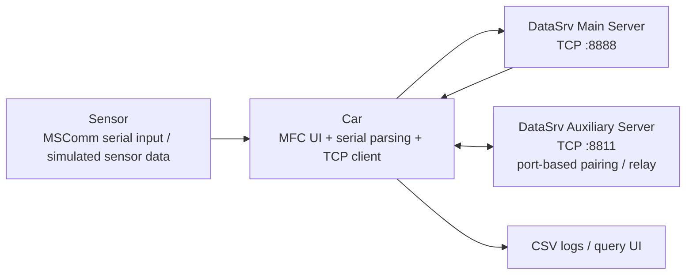

# Autonomous Driving Perception Communication System

这是我在课程设计中完成的一个三端协同系统。我没有把它做成单个窗口里的功能拼接，而是把问题拆成了 `Sensor`、`Car`、`DataSrv` 三个端，分别处理传感器采集、车辆侧交互和服务端汇聚。

这个仓库最想展示的不是“我做了一个自动驾驶 demo”，而是我怎么把一个同时涉及 `串口通信`、`TCP/IP`、`GUI`、`日志留存`、`车车通信` 的问题，先拆清楚，再一步步落成一个能运行、能演示、也能继续工程化的系统。

## 我做了什么

`Course Project · 2024.02.01 - 2024.03.01`

`Role · 系统拆分、串口与 TCP/IP 通信实现、车辆交互流程设计`

我基于 `C++` 开发，综合使用了 `MFC`、`MSComm`、`WinSock`、`STL` 和多线程机制，完成了这几个核心能力：

- 用传感器端模拟速度、车距、行人检测等感知数据
- 用车辆端接收串口数据、展示状态，并通过 TCP 上传服务端
- 用服务端管理连接、回传信息、记录状态，并承担中转职责
- 用 CSV 做基础日志留存和查询
- 在主链路之外，再实现一条车辆间通信链路

## 我是怎么拆这个问题的

我先把题目拆成四个子问题：

1. 传感器数据怎么统一采集，并稳定送到车辆端
2. 车辆端怎么同时处理串口输入、界面展示和网络上传
3. 服务端怎么同时承担接入、展示、反馈和存档职责
4. 车辆之间怎么在没有固定地址簿的前提下完成通信

对应地，我把系统拆成了三个端：

- `Sensor`
  负责模拟或采集传感器数据，并通过串口输出
- `Car`
  负责接收传感器数据、展示状态、上传服务端、查询日志、发起车车通信
- `DataSrv`
  负责 TCP 监听、连接管理、服务端反馈、端口登记和消息中转

这套拆法对我来说很重要，因为它让我先把系统边界定义清楚，再分别解决每一端的问题，而不是一开始就把所有逻辑塞进一个工程里。

## 系统结构

其中：

- 主链路负责感知数据上传和服务端反馈
- 辅助链路负责车辆间端口配对和消息中转

我这样做，是因为“感知上传”和“车车通信”本质上是两类问题，应该先在职责上分开。

## 这个仓库里有什么

- [`src/sensor/Sensor.sln`](./src/sensor/Sensor.sln)
  传感器端工程
- [`src/car/Car.sln`](./src/car/Car.sln)
  车辆端工程
- [`src/data-server/DataSrv.sln`](./src/data-server/DataSrv.sln)
  服务端工程
- [`docs/architecture.md`](./docs/architecture.md)
  我对系统拆分和数据流的整理
- [`docs/engineering-review.md`](./docs/engineering-review.md)
  我对当前实现边界、风险和后续改造方向的判断

## 你可以先看哪里

如果你想快速判断这个项目做到了什么，我建议这样看：

- 想看系统拆分：先看 [`docs/architecture.md`](./docs/architecture.md)
- 想看车辆端主流程：看 [`src/car/Car/02_TCPClientDlg.cpp`](./src/car/Car/02_TCPClientDlg.cpp)
- 想看日志查询：看 [`src/car/Car/DataSearch.cpp`](./src/car/Car/DataSearch.cpp)
- 想看车辆间通信：看 [`src/car/Car/CarCommu.cpp`](./src/car/Car/CarCommu.cpp)
- 想看服务端连接管理和转发：看 [`src/data-server/DataSrv/ServerSocket.cpp`](./src/data-server/DataSrv/ServerSocket.cpp) 和 [`src/data-server/DataSrv/MyServerSocket.cpp`](./src/data-server/DataSrv/MyServerSocket.cpp)
- 想看传感器抽象：看 [`src/sensor/Sensor/CSensor.h`](./src/sensor/Sensor/CSensor.h)

## 我认为这个项目真正有价值的地方

我觉得这个项目最值得展示的，不是“用了多少技术名词”，而是这几个判断：

- 我先用模拟传感器把链路跑通，而不是一开始就被真实硬件卡住
- 我先把 `串口 + TCP + GUI + 日志` 串成闭环，再继续加功能
- 我没有把车车通信直接糊进主上传链路，而是单独拆了辅助服务器
- 我保留了课程阶段的工程边界，并明确知道下一步应该往哪里改

换句话说，这个项目体现的是我的处理方式：

`先把问题收缩到可解范围，再做出能运行的系统，最后识别哪里需要继续工程化。`

## 当前实现边界

这个仓库不是“已经产品化”的版本，我也不想把它包装成那样。它现在的边界很明确：

- 传感器数据仍以模拟为主，还没有接入真实设备协议
- 一部分网络消息仍然是字符串级别，协议还不够结构化
- UI、网络、文件读写之间仍有耦合
- 线程模型已经开始用，但还不够完整
- CSV 更像课程阶段的数据留痕方案，不是正式数据层

这些不是我想掩盖的问题，反而是我希望读者能看到的地方，因为它们说明我知道系统已经做到哪里，也知道继续往前该怎么改。

更细的工程判断见 [`docs/engineering-review.md`](./docs/engineering-review.md)。

## 运行方式

开发环境基于 `Windows + Visual Studio + MFC`。

可以直接打开以下解决方案查看三端工程：

- `src/sensor/Sensor.sln`
- `src/car/Car.sln`
- `src/data-server/DataSrv.sln`

## 说明

- 仓库已经去掉了 `Debug`、`Release`、`.user`、`.aps` 等本地产物
- 我保留了原始课程项目的主体结构，方便别人直接看代码和工程组织
- 代码里仍有少量课程时期的本机路径和硬编码配置，它们本身也是这个项目当前工程边界的一部分
