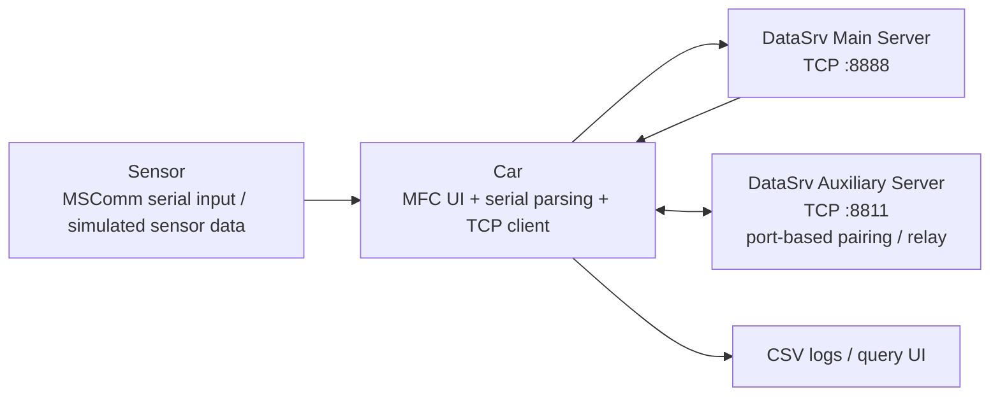

# Autonomous Driving Perception Communication System

自动驾驶感知通信系统课程项目整理版。

这个仓库面向三类读者：

- 老师：快速看懂问题定义、系统拆分和实现边界
- HR：快速判断我是否能把一个含设备、通信、界面、数据流的问题落成可运行系统
- 普通开发者：快速定位 MFC + 串口 + TCP/IP + 多端协同 的参考实现

如果只看 1 分钟，建议先看这三点：

- 我把题目拆成了 `Sensor / Car / DataSrv` 三端，而不是做成单窗口 demo
- 我同时处理了 `串口采集`、`TCP 上传`、`服务端汇聚`、`CSV 查询`、`车车通信`
- 我不仅给出能运行的方案，也明确指出了后续工程化该从哪里继续改

## Project Snapshot

`Course Project · 2024.02.01 - 2024.03.01`

`Role · 系统拆分、串口与 TCP/IP 通信实现、车辆交互流程设计`

基于 C++ 开发，综合使用 `MFC`、`MSComm`、`WinSock`、`STL` 与多线程机制，设计并实现 `Sensor`、`Car`、`DataSrv` 三端协同系统，完成感知数据的串口采集、TCP/IP 上传、服务端数据预警反馈与 CSV 日志查询。

在主数据链路之外，额外实现了基于端口号寻址和服务器中转的车辆间消息交互。当前系统中的传感器数据仍以模拟为主，后续可进一步接入真实设备并完善结构化协议、线程安全机制与数据管理架构。

## Quick Evaluation

老师视角可以重点看：

- 我是如何先定义系统边界，再分模块实现，而不是直接堆界面
- 三端之间的数据流是否完整闭环
- 我对当前方案不足和后续演进是否有清楚判断

HR 视角可以重点看：

- 这是一个跨 `设备通信 + 网络通信 + GUI + 数据留痕` 的综合型项目
- 我承担的是系统拆分、通信实现和交互流程设计，不是只补某个局部功能
- 仓库里既有可运行代码，也有对 tradeoff 和 engineering debt 的说明

## Problem Shape

我把题目拆成了四个子问题：

1. 传感器数据如何被统一采集，并从本地串口送入车辆端界面
2. 车辆端如何把多源感知数据上传到中心端，并接收预警或建议
3. 服务端如何同时承担汇聚、展示、转发和基础存档职责
4. 车辆之间如何在没有点对点固定地址簿的前提下完成消息交互

对应的系统拆分是：

- `Sensor`：模拟或采集不同传感器数据，负责串口侧输出
- `Car`：接收传感器数据，展示状态，上传服务器，并支持车辆间通信与日志查询
- `DataSrv`：负责 TCP 监听、连接管理、数据回传、端口登记和辅助转发

## Architecture

主链路负责感知上报与服务端反馈，辅助链路负责车辆间端口配对和中转通信。这种拆法的价值在于：

- 把“感知上传”和“车车通信”从职责上分开，避免所有逻辑塞进一个 socket 通道
- 保留了 GUI 演示效果，适合课程答辩与功能验证
- 让后续真实传感器接入、协议升级和线程治理有明确演进落点

## What Is In This Repository

- [`src/sensor/Sensor.sln`](./src/sensor/Sensor.sln)：传感器端工程
- [`src/car/Car.sln`](./src/car/Car.sln)：车辆端工程
- [`src/data-server/DataSrv.sln`](./src/data-server/DataSrv.sln)：服务端工程
- [`docs/architecture.md`](./docs/architecture.md)：系统拆分与关键流程
- [`docs/engineering-review.md`](./docs/engineering-review.md)：当前实现的工程评估、风险与下一步改造方向

## Key Implementation Points

### 1. Sensor side

- 通过 `MSComm` 封装串口配置与收发
- 把速度、车距、行人检测抽象成独立传感器类
- 当前数据源以随机模拟为主，便于先验证传输链路和 UI 交互

代表文件：

- [`src/sensor/Sensor/CSensor.h`](./src/sensor/Sensor/CSensor.h)
- [`src/sensor/Sensor/CSpeedSensor.cpp`](./src/sensor/Sensor/CSpeedSensor.cpp)
- [`src/sensor/Sensor/CDistanceSensor.cpp`](./src/sensor/Sensor/CDistanceSensor.cpp)
- [`src/sensor/Sensor/CPerSensor.cpp`](./src/sensor/Sensor/CPerSensor.cpp)
- [`src/sensor/Sensor/02_TCPClientDlg.cpp`](./src/sensor/Sensor/02_TCPClientDlg.cpp)

### 2. Car side

- 使用 MFC 界面承接串口数据显示、TCP 连接、状态提示和日志查询
- 将车辆端作为主数据消费节点，同时承担上传、展示和交互职责
- 增加 CSV 查询窗口与车车通信窗口，让系统不只是“收发数据”，而是形成完整闭环

代表文件：

- [`src/car/Car/02_TCPClientDlg.cpp`](./src/car/Car/02_TCPClientDlg.cpp)
- [`src/car/Car/DataSearch.cpp`](./src/car/Car/DataSearch.cpp)
- [`src/car/Car/CarCommu.cpp`](./src/car/Car/CarCommu.cpp)

### 3. DataSrv side

- 主服务器监听 `8888`，负责车辆连接接入与消息回传
- 辅助服务器监听 `8811`，基于端口号建立车辆配对关系
- 使用列表与 CSV 做基础连接登记，支持演示连接状态变化

代表文件：

- [`src/data-server/DataSrv/02_TCPServerDlg.cpp`](./src/data-server/DataSrv/02_TCPServerDlg.cpp)
- [`src/data-server/DataSrv/ServerSocket.cpp`](./src/data-server/DataSrv/ServerSocket.cpp)
- [`src/data-server/DataSrv/MyServerSocket.cpp`](./src/data-server/DataSrv/MyServerSocket.cpp)

## Why This Project Shows Problem-Solving Ability

这个项目的价值不在于“自动驾驶”概念本身，而在于把一个跨设备、跨进程、跨通信方式的问题拆成了可迭代的三端系统：

- 先用模拟传感器替代真实硬件，优先验证数据链路
- 先用 GUI 把链路可视化，再补日志和查询
- 先用字符串协议与端口配对把功能跑通，再考虑协议结构化
- 先形成可演示闭环，再识别线程安全、配置解耦和数据建模等工程问题

这类处理方式更接近真实开发中的 `problem shape -> working system -> engineering refinement`，而不是只完成单点功能。

## Build Notes

开发环境基于 Windows + Visual Studio + MFC。

直接打开以下解决方案即可查看三端工程：

- `src/sensor/Sensor.sln`
- `src/car/Car.sln`
- `src/data-server/DataSrv.sln`

说明：

- 仓库已去掉 `Debug/Release/.user/.aps` 等本地产物
- 代码中仍保留部分课程时期的本机路径和 CSV 路径，用于说明原始实现边界
- `Car` 工程里原先引用了若干桌面资源文件，这里已保留源码主体并将仓库整理为便于阅读与继续清理的状态

## Known Gaps

- 传感器数据仍以随机模拟为主，尚未接入真实设备协议
- 网络协议主要依赖字符串和端口号，缺少结构化消息体与版本管理
- UI、网络、文件写入和业务逻辑耦合较深
- 存在线程模型较粗、共享状态边界不清的问题
- CSV 更像课程阶段的数据留痕方案，距离正式数据层还有明显差距

这些问题不是回避点，而是这个仓库里最适合继续展开的工程化切入口。详细说明见 [`docs/engineering-review.md`](./docs/engineering-review.md)。
